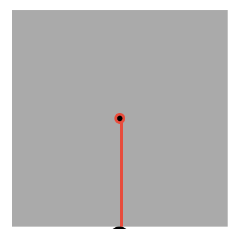

主题切换就是修改页面主体色，和次要色，通过变量来修改

难点在于钟表,首先实现这种效果  


指针就是 div,只是宽度很窄，首先是定位

```css
position: absolute;
top: 50%;
left: 50%;
```

  
但是这不是 0 点，后面指针的旋转是要从 0 点开始的，所以我们还要首先移动到 0 点为止

```css
position: absolute;
top: 50%;
left: 50%;
transform: translate(-50%, -100%);
```


移动是整体的上移，现在应该是以尾部为中心旋转，左图是移动以后的  


设置旋转中心为 `transform-origin: bottom center`;

之后则是获取到当前时间，拿到 时 分 秒，然后对应旋转

```javascript
const hours = timer.getHours(); //getHours 返回一个 0 到 23 之间的整数值。
// hours 范围在[0,23]，但是钟表只有[0,12],所以13就是1,14就是2
const hoursForClock = hours >= 13 ? hours % 12 : hours;

const minutes = timer.getMinutes(); //getMinutes 返回一个 0 到 59 的整数值。
const seconds = timer.getSeconds(); //该方法返回一个 0 到 59 的整数值。
```

比如 秒针旋转是 360deg, 但是秒的范围是 0-59，即 0 秒对应 0 度，1 秒对应 6 度，59 秒对应 354 度，60 秒对应 360 度,根据 当前秒数计算旋转度数.

这时候需要一个映射函数，将[0,60]范围映射到[0,360]。  
还映射函数基于线性插值的原理。线性插值的目标是找到一个点在某个范围内的位置，然后将这个位置映射到另一个范围的相应位置。  

