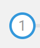
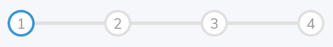
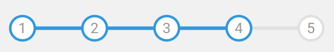

1. 序号以及序号外层的框：  
   

序号就是 div,需要设置 border-radius: 50%;外层的框就是边框

2. 深灰色的进度条  
     
   用的是伪元素，就是用了一个 div,长度和父容器一致，高度设置一点点，需要开启定位，在父容器中居中显示，居中用的就是
   定位+transform 实现，z-index-1,要显示在序号的下面

3. 蓝色的进度条  
     
   就是一个 div,和灰色的一样，颜色不一样，进度通过 width 的长度与父容器长度的百分比设置，width：100%就是进度的 100%
4. 按钮点击时进度的展示  
    就是设置一个当前的进度值 curActive，获取到所有的进度值，就是序号元素，next 就是+1,prev 就是-1，不过需要判断边界情况
   每次点击 prev 或者 next 时需要更新 DOM：  
   一:更新序号，序号数组中的索引小于 curActive 值的所有序号设置为 active ,大于等于 curActive 值的取消 active 类  
   二:更新进度，进度通过当前的 curActive 值与序号数组的长度判断，5 个点就是四段，数组长度是 5，利用活跃的边/所有边 来计算进度百分比  
   三：更新 prev 和 next 按钮，检测边界情况时设置 disabled，其他情况下可以点击
   ```javascript
   function update() {
   // 添加/删除active类
   circls.forEach((item, index) => {
    if (index < curActive) {
      item.classList.add("active");
    } else {
      item.classList.remove("active");
    }
   });
   // 更新按钮
   if (curActive === circls.length) {
   nextBtn.disabled = true;
   } else if (curActive === 1) {
   prevBtn.disabled = true;
   } else {
   prevBtn.disabled = false;
   nextBtn.disabled = false;
   }
   // 更新进度条
   let percentage = ((curActive - 1) / (circls.length - 1)) \* 100;
   progress.style.width = percentage + "%";
   }
   ```
