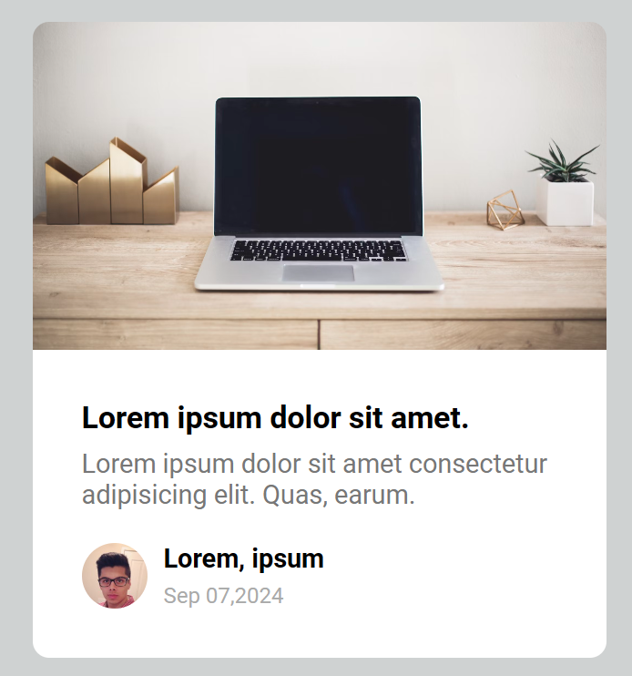

### 这种问题难点在于如何设计内容占位

这里采用的方法是通过 css 做，占位的元素有特定的类标记，在拥有这些类的时候，显示的效果就是占位形式  
删除这些类以后，就是正常的内容。  
另外，在占位的情况下，图片或者或文本全都是不存在的：  
图片由其外层的盒子来占位，文本由其元素本身来占位，因为盒子或者元素内部没有内容，所以盒子的宽度和高度不能仅仅依赖内容撑开，否则就会坍缩，占位时的素必须有自己的宽度和高度。


#### 图片元素的处理

图片通常会用一个 div 包裹，这个外层的 div 就可以作为内容占位元素，这个 div 需要设置好宽度和高度，在最初显示占位元素的时候，盒子内部是没有 img 元素的，所以不能让盒子只靠 img 撑开

#### 文本元素的处理

文本本身可以直接设置为内容占位符

首先不考虑内容占位，先实现最后的效果图:  


接着实现两个类:

```css
/* 所有盒子的占位 */
.animated-bg {
  background-image: linear-gradient(
    to right,
    #f6f7f8 0%,
    #edeef1 10%,
    #f6f7f8 20%,
    #f6f7f8 100%
  );
  background-size: 200% 100%; /*100%，100%y也可以，没啥区别*/
  animation: bgPos 1s linear infinite;
}

/* 针对文本的占位 */
.animated-bg-text {
  /* 
  1.正常的文本是不用设置宽度和高度的，通常都是由内容撑开
  2.但是占位的情况下，内部的内容会首先删除，这就要占位元素具备宽度和高度才行
  3.正式因为要设置宽度和高度，才需要将这些元素设置为行内块，不然宽度和高度不起作用
  */
  display: inline-block;
  height: 10px;
  /*文本的宽度是相对于父元素的，所以父元素要有一定的宽度，不能只靠文本撑开
  如果父元素没有设置，那可以是块级元素，默认会占据一整行
  */
  width: 100%;
  margin: 0;
  border-radius: 50px;
}

/* 不用动画也可以 */
@keyframes bgPos {
  0% {
    background-position: 50% 0;
  }

  100% {
    background-position: -150% 0;
  }
}
```

在需要占位的元素区域，加上这两个类，比如：

```html
<div class="card">
  <!-- 顶部图片 -->
  <div class="card-header animated-bg" id="header">
    
  </div>

  <!-- 文本 -->
  <h3 class="card-title animated-bg animated-bg-text" id="title">
    Lorem ipsum dolor sit amet.
  </h3>
</div>
```

之后，把盒子内部的图片或者是文本都删除，那么页面最初显示的效果就是占位的效果。比如：

```html
<!-- 图片 -->
<div class="card-header animated-bg" id="header"></div>

<!-- 文本 -->
<h3 class="card-title animated-bg animated-bg-text" id="title"></h3>
```

之后，我们有了数据则是显示数据，这里我们使用定时器模拟：

```javascript
// 在1.5s以后有了数据，我们显示内部的图片与文本，同时把占位元素的 身上的类 删除
setTimeout(getData, 1500);

function getData() {
  header.innerHTML =
    '';
  title.innerHTML = "Lorem ipsum dolor sit amet";
  excerpt.innerHTML =
    "Lorem ipsum dolor sit amet consectetur adipisicing elit. Dolore perferendis";
  profile_img.innerHTML =
    '';
  nameEl.innerHTML = "John Doe";
  date.innerHTML = "Oct 08, 2020";

  // 最好是先设置原本的效果以后，在把对应的类删除掉
  animated_bgs.forEach((bg) => bg.classList.remove("animated-bg"));
  animated_bg_texts.forEach((bg) => bg.classList.remove("animated-bg-text"));
}
```
