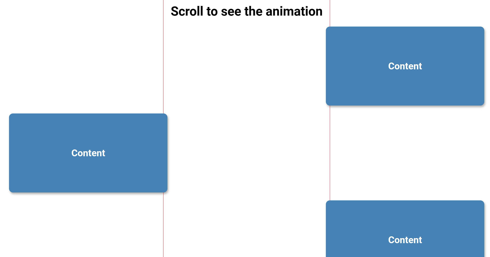
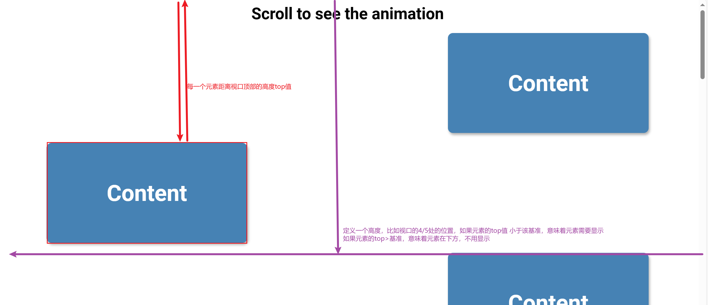
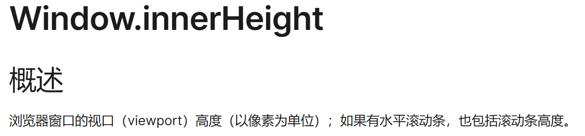
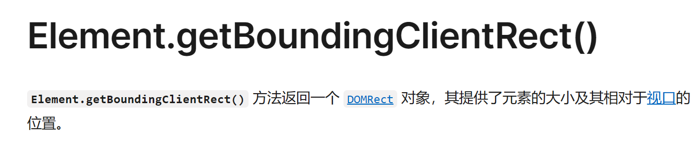

我们先实现下面的效果：
  
这种效果的实现就是对每一个 item 使用了 translateX,全部产生偏移 ，然后使 nth-child(odd)，选中奇数的元素向反方向偏移

在滚动滚轮时，让符合条件的元素在偏移到原位置处。

**关键点是 在滚动时 如何判断元素需要偏移**

获取浏览器视口高度 Window.innerHeight  

获取元素的信息 Element.getBoundingClientRect()  

